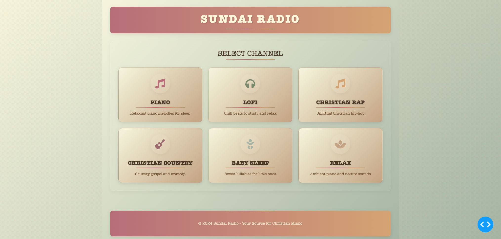

# Sundai Radio Player

A beautiful, retro-styled web radio player built with Dash and Python. This application provides a curated selection of Christian music channels with a 1940s-inspired design.



## Features

- 🎵 Multiple Christian music channels
- 🎨 Retro 1940s-inspired design
- 🎧 High-quality audio streaming
- 📱 Responsive layout
- 🎯 Easy channel selection
- 🎹 Categories include:
  - Piano
  - Lofi
  - Christian Rap
  - Christian Country
  - Baby Sleep
  - Relax

## Quick Start

### Using Docker

```bash
# Pull the image
docker pull ghcr.io/okekedev/sundai-radio:latest

# Run the container
docker run -p 8081:8081 ghcr.io/okekedev/sundai-radio:latest
```

### Local Development

1. Clone the repository:
```bash
git clone https://github.com/okekedev/sundai-radio.git
cd sundai-radio
```

2. Create and activate a virtual environment:
```bash
python -m venv venv
source venv/bin/activate  # On Windows: venv\Scripts\activate
```

3. Install dependencies:
```bash
pip install -r requirements.txt
```

4. Run the application:
```bash
python src/app.py
```

The application will be available at `http://localhost:8081`

## Technology Stack

- Python 3.11
- Dash
- Docker
- GitHub Actions for CI/CD

## Contributing

Contributions are welcome! Please feel free to submit a Pull Request.

## License

This project is licensed under the MIT License - see the [LICENSE](LICENSE) file for details.

## Acknowledgments

- Inspired by 1940s radio design
- Built with ❤️ for the Christian community 